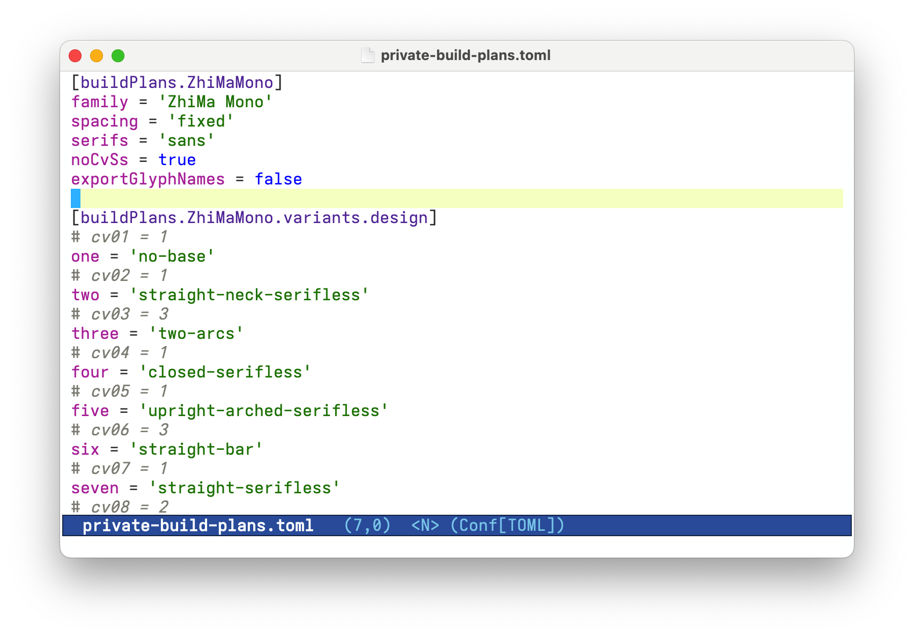

`ZhiMaMono` is a monospace font based on [Iosevka](https://github.com/be5invis/Iosevka). It only contains visible ASCII characters, resulting in a compact file size, and the character width and margin have been widened (Iosevka appears narrower in comparison).

You can download [ZhiMaMono](ZhiMaMono-Regular.ttf) directly.

# Build from Source

To build `ZhiMaMono` from source you should:

1. Install [nodejs](http://nodejs.org) (>= 18.0.0) and [ttfautohint](http://www.freetype.org/ttfautohint/). Make sure that they are accessible from [PATH](https://en.wikipedia.org/wiki/PATH_(variable)).
2. Run `build.sh`.

# Screenshot

